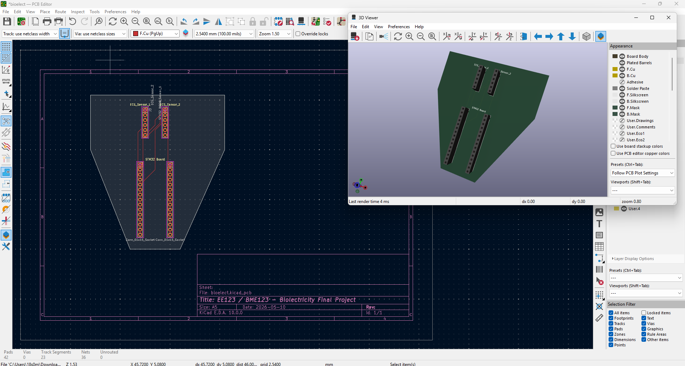
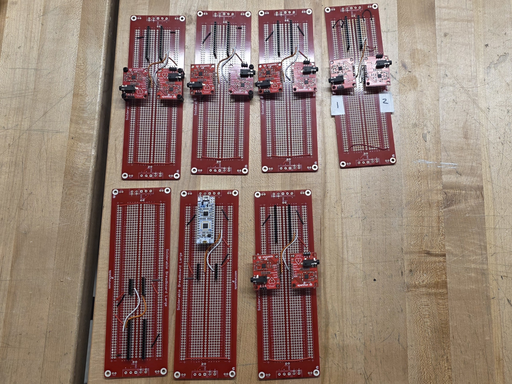
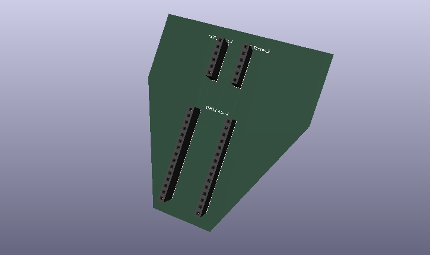
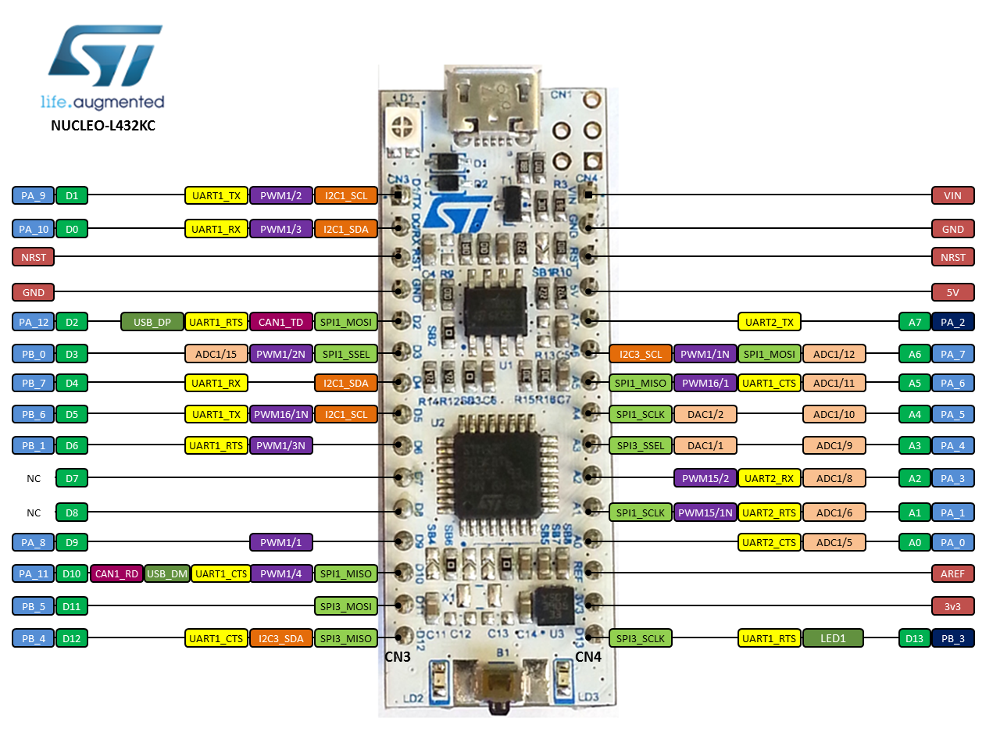

# Final_Project_PCB_Design_EE123-BME123_Bioelectricity
Design of the circuit designed for the final project in Tufts University's bioelectricity course (EE123/BME123) taught by Joel Grodstein.

# Introduction

Across finals week, I offered to help my advisor solder some components onto a PCB for the final project attached to his bioelectricyt course (EE123/BME123). I love to solder and found this a fun opportunity to explore to destress away from finals. I also wanted to share the experience with others who may be interested in learning how to solder or want to see what the final project looks like.

After soldering the components, I took some pictures of the final product and shared them on my GitHub repository. Here are the boards:

# Custom PCB Design

However, I did not want to stop there. The boards I built were organized by my advisor with a breadboard pcb design, which is a great way to organize the components and make it easier to solder; and, there's a lot of space that goes unused in choosing this quick and easy design. I wanted to take it a step further and design a custom PCB that would be more compact and efficient for the final project. I used kiCad to create the layout for the custom PCB, which involved placing the components in a more efficient way and routing the connections between them. After too many YouTube tutorials and some trial and error, I was able to create a custom PCB design that I am proud of. I shared the design files on my GitHub repository as well, so that others can see how I approached the design process and maybe even use it as a starting point for their own projects.

This repo is mostly for me to keep track of my progress. This was my first attempt at designing a custom PCB.

The board relies on an STM32 NUCLEO-L432KC microcontroller. The following diagram refers to it.

I hope this can be a helpful resource for students in the future who are working on similar projects or just want to see what a PCB design looks like for a bioelectricity project.

# Course Website

[https://www.ece.tufts.edu/ee/123/](https://www.ece.tufts.edu/ee/123/)

Feel free to reach out if you have any questions or want to collaborate on future projects!